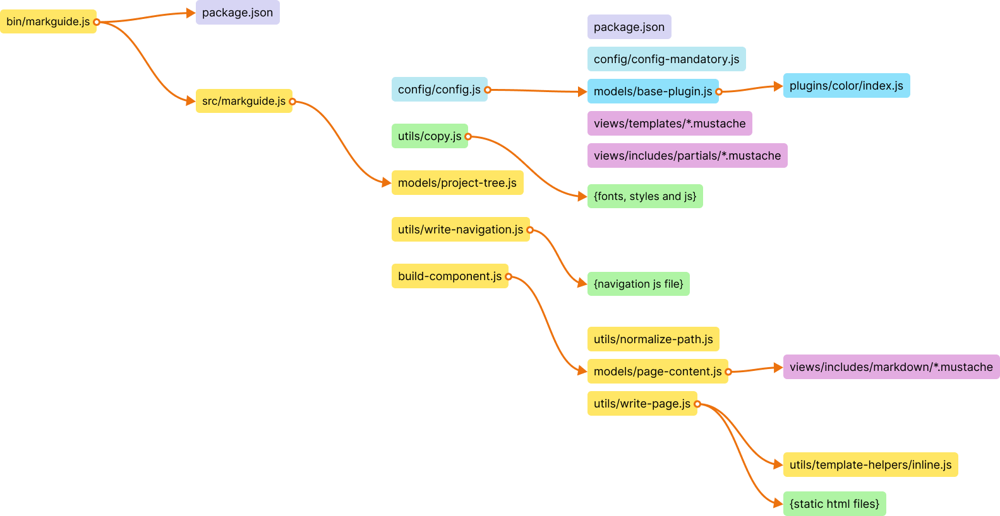

# Markguide

Markguide is a living style guide, pattern library, and documentation static site generator with plugin support. It generates documentation from Markdown files and documentation comments in `scss` files.

It is opinionated because it is probably impossible to cover all cases in CSS/Sass. It is designed primarily as a "style-guide-driven development" tool with a focus on a split-files approach and encapsulated components with standard Sass import structures.

* [Live example](https://nfxpnk.github.io/markguide/)

## Folder Structure

This documentation provides an overview of the folder structure for this project, including the purpose of each folder and its contents.

### `_example`

This folder contains SCSS example files and static HTML file destinations.

```
|-- custom-plugins
|   `-- dummy
|-- markguide-static
|   |-- assets
|   |-- images
|   |-- scripts
|   `-- styles
|-- projects-static-files
`-- scss-source
    |-- blocks
    |-- components
    `-- configuration
```

### `_helpers`

This folder contains miscellaneous helper scripts.

### `assets`

This folder contains CSS and JavaScript files for the static HTML files.

### `bin`

This folder contains the executable files for the project's modules.

### `scss`

This folder contains SCSS files for the style guide only.

### `src`

This is the main folder that contains all the modules' JavaScript files.

```
|-- config
|-- models
|-- plugins
|   |-- colors
|   |-- icons
|   `-- typography
|-- utils
|   `-- template-helpers
`-- views
    |-- includes
    |   |-- markdown
    |   `-- partials
    `-- templates
```

## Features

* Blazing fast thanks to Mustache and Marked. It is primarily designed as a development platform.
* Supports incremental builds, so only changed pages are updated.
* Can be set up with livereload.
* Small list of dependencies:
    * ansi-colors
    * fancy-log
    * lorem-ipsum
    * marked
    * mustache
    * pug
* All internal templates and styles can be overwritten on the project level.
* Can be used as a simple guide docs generator.

### Components library

Supports `/*md` comments in `scss` files where regular Markdown can be placed.

* Consists of two main types of pages — component and guide — and can be expanded to additional types.
* Navigation tree mirrors the project tree to make large component libraries easier to browse.
* Supports plugins.

### Guide

Supports regular Markdown files in components folders and processes them as guideline pages.

* Markdown support.

## Getting started

### Requirements

* Node.js >= 18
* npm >= 8.19

### Installing

```
npm install markguide
```

### Configuring

#### Minimal configuration

`.markguiderc.json`:

```json
{
    "guideSrc": "_example/scss-source",
    "guideDest": "_example/markguide-static",
    "cssSrc": "assets/css",
    "projectStaticFiles": "_example/projects-static-files",
    "projectImagesFolder": "images",
    "projectStylesFolder": "",
    "projectScriptsFolder": "",
    "projectFontsFolder": "fonts",
    "projectStyles": [
        "styles"
    ],
    "projectScripts": [
        "main"
    ],
    "internalAssetsPath": "assets",
    "customPluginsPath": "_example/custom-plugins",
    "enabledPlugins": [
        {
            "name": "icons",
            "options": {
                "iconsFolder": "icons",
                "fileExtension": "svg"
            }
        },
        {
            "name": "colors",
            "options": {
                "filePath": "configuration/_colors.scss"
            }
        },
        {
            "name": "typography",
            "options": {}
        },
        {
            "name": "dummy",
            "options": {
                "filePath": "file.html"
            }
        }
    ],
    "projectFonts": [
        {
            "filename": "roboto-regular.woff2",
            "properties": {
                "family": "Roboto",
                "style": "normal",
                "weight": "400"
            }
        },
        {
            "filename": "roboto-bold.woff2",
            "properties": {
                "family": "Roboto",
                "style": "normal",
                "weight": "700"
            }
        }
    ]
}
```

Then in `package.json`

```json
{
  "scripts": {
    "build-styleguide": "markguide --build=./path/to/config.json"
  }
}
```

### Writing documentation

In `path/to/scss/style.scss`:

```scss
/*md

# Component name

Component description.

Component example (add one more backtick to make this example work):

``html_example
<h1>Some</h1>
``

``pug_example
h1 Some
``
*/

.regular-scss-here {
    margin: 0;
}
```

### Building

```
npm run build-styleguide
```

### API

```js
const markguide = require('markguide').withConfig('./project/root/path/to/config.json');
// or markguide = require('markguide').withConfig({ rawConfigObject });
markguide.build().then(...); // build all guide files without reports. Returns promise.
markguide.build('/absolute/path/to/changed/file.scss').then(...); // compile only particular file, if it marked as documented in project tree. Returns promise.
markguide.buildAll().then(...); // compile all guide pages. Returns promise.
```

Use `markguide.build()` for incremental development builds.

### CLI

```shell
Usage: markguide [OPTION]

Options:            
  -b, --build=FILE           build all markguide pages, followed with config '--build=./path/to/config.json'
  -v, --version              print version
  --help                     print this message
```

## Configuration

Requires explicit configuration in the `.withConfig()` method.

Minimal configuration:

```json
{
    "guideSrc": "path/to/your/scss/",
    "guideDest": "path/to/your/static/folder/for/guide/",
    "cssSrc": "assets/css/",
    "projectStaticFiles": "path/to/your/static/files/",
    "projectImagesFolder": "images",
    "projectStylesFolder": "",
    "projectScriptsFolder": "",
    "projectFontsFolder": "fonts",
    "internalAssetsPath": "assets"
}
```

You could place it wherever you want and target with:

```js
const markguide = require('markguide').withConfig('./from/project/root/path/to/my/config.json');
```

or with rawConfig object if you call markguide from js:

```js
const markguide = require('markguide').withConfig({
    guideSrc: 'path/to/your/scss/',
    guideDest: 'path/to/your/static/folder/for/guide/',
    cssSrc: 'assets/css/',
    projectStaticFiles: 'path/to/your/static/files/',
    projectImagesFolder: 'images',
    projectStylesFolder: '',
    projectScriptsFolder: '',
    projectFontsFolder: 'fonts',
    internalAssetsPath: 'assets'
    // etc
});
```

### Templates overwrites

As the next step you, probably, want to add your project CSS and JS to render components examples properly.
To make this happen you need to add `partials` to the config, with paths to the templates in your project space:

```json
{
    "partials": {
      "assetshead": "project-root/path/to/project-head.mustache",
      "assetsfooter": "project-root/path/to/project-footer.mustache"
    }
}
```

Note, that paths can be absolute or relative to your project root (the current working directory). This is a simple include that will be incorporated into the resulting HTML.

All templates and partials could be overwritten. Please see this repo `src/views` folder to get list of all templates and partials.

### Configuration options

Required paths

* !`guideSrc` {string} – path to scss files that are documented.
* !`guideDest` {string} – path to generated files folder.
* !`cssSrc` {string} – path to generated CSS (used by templates).
* !`projectStaticFiles` {string} – base path for static files (images, styles, scripts, fonts).
* !`projectImagesFolder` {string} – folder name under `projectStaticFiles` with images.
* !`projectStylesFolder` {string} – folder name under `projectStaticFiles` with stylesheets.
* !`projectScriptsFolder` {string} – folder name under `projectStaticFiles` with scripts.
* !`projectFontsFolder` {string} – folder name under `projectStaticFiles` with fonts.
* !`internalAssetsPath` {string} – path to Markguide internal assets.

Optional fields

* `excludedDirs` {regexp|string} – directories that will be excluded from doc sets.
* `excludedSassFiles` {regexp|string} – Sass files that will be excluded from doc sets.
* `projectStyles` {array} – list of stylesheet basenames or full URLs to include in rendered pages.
* `projectScripts` {array} – list of script basenames or full URLs to include in rendered pages.
* `projectFonts` {array} – font metadata used in templates.
* `customPluginsPath` {string} – path to custom plugins folder.
* `enabledPlugins` {array} – list of plugin configs (`name` and `options`).
* `templates` {object} – map of template overrides keyed by template name.
* `partials` {object} – map of partial overrides keyed by partial name.
* `sourceReplacements` {object} – string replacements applied when copying CSS files.
* `projectInfo`
    * `name` {string} – custom project name. Otherwise the package name will be used.


### Documenting code

#### Doc comment

Add this comment to the scss file and the file appears as a component page.

```scss
/*md

# Component name

 */
```

Inside this comment regular Markdown syntax is used, so any valid Markdown will work here.

```scss
/*md

# Heading level 1

## Heading level 2

## Heading level 3

Regular paragraph with **bold**, _italic_ and `inline code`.

* list item
* list item
* list item

1. ordered list item
2. ordered list item
3. ordered list item

etc.

 */
```

#### Component example

It extends Markdown fenced code blocks with a custom type (like Hologram) — `html_example` and `pug_example`.
That renders component HTML instead of a code example, keeping documentation compatible with regular Markdown.

To create a component example you need to add a code block with `html_example`:

```scss
/*md

``html_example
<h1>Add one more backtick to make this example works</h1>
``

*/
```

#### Regular code blocks

Simple `html`, `scss`, `css` "fences" become regular code-block:

```scss
/*md

``html
<h1>heading 1</h1>
``

``scss
.some { margin: 0; }
``

*/
```

#### Template helpers

To inline some resources like svg icons, inlined styles etc. you could use `inline` helper. Ex:

```html
{{#inline}}project-root/assets/src/images/icons.svg{{/inline}}
```

This helper uses the path to a file from your *project root*. Virtually any file can be inlined.

### Guideline/Documentation page

Simply put regular markdown file to components tree and they automatically become part of the markguide.

### Build guide

#### Incremental builds

Regular development flow could be organized in this way – build all guide pages on start and incrementally rebuild pages on file changes:

```js
const markguide = require('markguide').withConfig({config: 'here'});
markguide.build().then(...); // build all guide files without reports

// watch for changes, get changed file path and build needed page:
markguide.build('/absolute/path/to/changed/file.scss').then(...); // compile only this file if was documented on module import
```

##### Gulp example

See example guideline page or this repo `gulpfile.js` to get the idea how live reload and incremental builds could be set upped.

#### Complete generation

Due to time efforts reports not generated in regular flow. To generate reports you need to call `npm markguide --build`
or in JS:

```js
const markguide = require('markguide').withConfig({config: 'here'});
markguide.buildAll().then(...); // compile all components, guidelines
```

## Development tree


## Troubleshooting

### We have 2 document comments `/*md` in scss file, but only first is shown in documentation.

This is done intentionally. It all designed for 1 component 1 scss file structure. Otherwise it is very hard to keep components readable and supportable.

## Contributing

You are welcome for ideas, help and of course code contributing. Please see CONTRIBUTING for more details.

## License

Published under MIT license.
